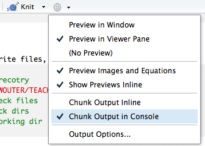

***
```{R}
## set working direcotry
setwd("~/Brein_en_Cognitie/LC1/") ##<======= SET THIS TO YOUR LC1 FOLDER!
```

```{r, eval=FALSE}

Put {r, echo=FALSE} in the header of a code block to exclude the commands and only print output.

Note that for text outside R blocks a double SPACE at the end of a line means NEWLINE, whereas in the codeblocks a simple ENTER will suffice.


```

For more one Rmarkdown http://rmarkdown.rstudio.com/authoring_basics.html
and see the [cheatsheet](https://www.rstudio.com/wp-content/uploads/2015/02/rmarkdown-cheatsheet.pdf)

# 1. basic numerical opertions

```{r, results='hide'}
1+1
2*3
3-4
1e+2
1e-2
2^2
sqrt(4)
log(10)
```
if you want to know more about a function you can type
```{r, eval=FALSE}
?function_name or help(function_name)
```
in the console. Further info should then appaer on the right in the Help tab.

***

### Q1 Try _?log_ to read how to use log function. What are the two ways to calculate the log of 10 using base 10?
***
(please list all answwers are pasted at the end of the document)


# 2. Variable assignment
We assign values to variables with the assignment operator "=". Just typing the variable by itself at the prompt will print out the value. We should note that another form of assignment operator "<-" is also in use.
```{r}
x = 10 # by the way this is a commment (using a #)
y <- 11
x
y
x*y
```

Note there is also an operator  <<- This is normally only used in functions, and cause a search to made through parent environments for an existing definition of the variable being assigned. If such a variable is found (and its binding is not locked) then its value is redefined, otherwise assignment takes place in the global environment.
see ?"<-" for more info.


***

### ! Running lines of code
You can run multiple lines of code by selecting them in the coding window and pressing cmd+enter.
See example below, if you execute this code you will set x and y in the workspace of R and can then be used for further manipulation.


This can be useful if you want to compute in between steps, it is now recommended to only run Knitr code to produce the final report given that it will not use the data stored in the workspace but will always start from scratch.
Make sure that you have tell Rstudio to ouput chunks to the console not inline:

NOTE YOU MAY HAVE TO DO THIS FOR EACH TIME YOU OPEN AN .Rmd FILE FOR THE FIRST TIME FOR EACH SESSION
***

# 2. Data Types


#### Numbers
Decimal values are called numerics in R. It is the default computational data type. If we assign a decimal value to a variable x as follows, x will be of numeric type.
```{r}
x = 10.5       # assign a decimal value
x              # print the value of x

class(x)       # print the class name of x
```

  ***

### Q2 if you assigning an integer value to a variable ( e.g. k = 1), will the data value also be integer ? please check
***
```{r}
k = 1
```
In order to create an integer variable in R, we invoke the as.integer function. We can be assured that k is indeed an integer by applying the is.integer function.

```{r}
k = as.integer(k)
class(k)       # print the class name of y
is.integer(k)  # is y an integer?
```

It may be useful to perform arithmetic on logical values. Like the C language, TRUE has the value 1, while FALSE has value 0.
```{r}
as.integer(TRUE)    # the numeric value of TRUE
as.integer(FALSE)   # the numeric value of FALSE
```

#### LOGICAL
A logical value is often created via comparison between variables.
```{r}
x = 1; y = 2
z = x > y      # is x larger than y?
z              # print the logical value
```
Standard logical operations are "&" (and), "|" (or), and "!" (negation)
```{r}
u = c(TRUE, TRUE); v = c(FALSE,TRUE)
u & v          # Element-wise logical AND
u && v         # Logical AND
u | v          # Element-wise u OR v
u || v        # logical OR
!u             # negation of u
```
Standard relational operations
```{r}
w ="truth" # a string
x = 0
w == "false" # note use double == for identity
x != 3 # x is not 3
x == 0 # note use double == for identity
x <= 0 # smaller or equal
x >= 0 # larger or equal
```
Further details and related logical operations can be found in the R documentation.
```{r}
help("&")
```

#### STRING
String values are simply made by using ""
```{r}
first = "Wouter"
last ="van den Bos"
#Two character values can be concatenated with the paste function.
paste(first, last)
```

#### VECTORS

A vector is a sequence of data elements of the same basic type. Members in a vector are officially called components.

Here is a vector containing three numeric values 2, 3 and 5.
```{r}
v1 = c(2, 3, 5)
v1
```

Here is one vector with strings
```{r}
v2 = c("A", "B", "C", "D", "E")
v2
# or an empty vector can be useful
v3 = c()
```

  Combining vectors works with the same function to create them
```{r}
v4 = c(v1,v2,v3)
v4
```

#### Value Coercion

In the code snippet above, notice how the numeric values are being coerced into character strings when the two vectors are combined. This is necessary so as to maintain the same primitive data type for members in the same vector.

  Lets check the number of elements of this new vector
```{r}
length(v3)
```

  Arithmetic operations of vectors are performed member-by-member, i.e., memberwise.


For example, suppose we have two vectors a and b.

```{r}
a = c(1, 3, 5, 7)
b = c(1, 2, 4, 8)
```
Then, if we multiply a by 5, we would get a vector with each of its members multiplied by 5.

```{r}
5 * a
```
And if we add a and b together, the sum would be a vector whose members are the sum of the corresponding members from a and b.
```{r}
a + b
```
Similarly for subtraction, multiplication and division, we get new vectors via memberwise operations. Empty vectors can also be created
```{r}
a - b
a * b
a / b

e = c()
```

***
### Q3 the __seq__ function is very useful ot make sequences of numbers, which will be saved as vectors. Look up how __seq__ works and make a sequence starting at 0 ending at 100 in steps of 2?
***


We can also construct a grid by combining to vectors using __expand.grid__
This can be usefull when you want to test a function for a combination of parameters
```{r}
xgrid <- seq(1,3,1) # short for of seq
xygrid <- seq(-2,0,1)
grid <- expand.grid(xgrid, ygrid) # not limited to 2D can be longer list of lists
grid
```
__expand.grid__ can also use with more than 2 variables
```{r}
xgrid <- seq(1,3,1) # short for of seq
ygrid <- seq(-2,0,1)
zgrid <- seq(3,5,1)
grid <- expand.grid(xgrid, ygrid,zgrid)
head(grid) # use the head() function to just display the top of the table
```

We retrieve values in a vector by declaring an index inside a single square bracket "[]" operator.

For example, the following shows how to retrieve a vector member. Since the vector index is 1-based, we use the index position 3 for retrieving the third member.
```{r}
v1 = c("A", "B", "C", "D", "E")
v1[3] # get the third member of the vector
```
Unlike other programming languages, the square bracket operator returns more than just individual members. In fact, the result of the square bracket operator is another vector, and s[3] is a vector slice containing a single member "C".


__Negative Index__

If the index is negative, it would strip the member whose position has the same absolute value as the negative index. For example, the following creates a vector slice with the third member removed.

```{r}
v1[-3] # remove the third member of the vector (display what is left)
```
  __extracting multiple elements__

Vectors can be used to get multiple elements from a vector, even including duplicates:
```{r}
v1[c(2,1,2,1)]
```
To produce a vector slice between two indexes, we can use the colon operator ":". This can be convenient for situations involving large vectors.
```{r}
v1[2:4]
```

#### Vector operations

__min()__ and __max()__
for numerical vectors we can use __min()__ and __max()__ to get the min and max value
```{r}
x = seq(1,10,.5)
min(x)
max(x)
```
If you want to know where to find the min or max in the vector:
```{r}
which.max(x)
which.min(x)
```
Besides __min()__ and __max()__ there are numerous operations you can peform on a vector. Here is a list of a few useful ones:
```{r, eval=FALSE}
sum()

mean()

median()

range()

var() # the variance in the vector

sd() # standard devation
```


__RANDOM__
Genetating random numbers or sequence of random numbers is also very useful for running simulations
```{r}
set.seed(123) # set random seed such that you can replicate results!
rr =runif(100, 0, 1) # generates 100 random numbers between 0 and 1. unif indicates uniform distribution such that each number between 0 and 1 is chosen with equal probability

```

***
### Q4 find the minimum and maximum of the random numbers you just generated, and also the position in the list:
***

```{r}
```

  ***
### Q5 try to plot all random numbers using __plot()__ and identify the min and max in it using __abline()__ to add (h)orizontal and (v)ertical lines

(hint: use ?plot and ?abline)

***


__MATRIX__
A matrix is a collection of data elements arranged in a two-dimensional rectangular layout. The following is an example of a matrix with 2 rows and 3 columns.
```{r}
A = matrix( c(2, 4, 3, 1, 5, 7), nrow=2, ncol=3, byrow = TRUE)        # fill matrix by rows

A                      # print the matrix
```
An element at the mth row, nth column of A can be accessed by the expression A[m, n].
```{r}
A[2, 3]      # element at 2nd row, 3rd column
```

The entire mth row A can be extracted as A[m, ].
```{r}
A[2, ]       # the 2nd row
```
Similarly, the entire nth column A can be extracted as A[ ,n].
```{r}
A[ ,3]       # the 3rd column
```
We can also extract more than one rows or columns at a time.
```{r}
A[ ,c(1,3)]  # the 1st and 3rd columns
```
Transpose
We construct the transpose of a matrix by interchanging its columns and rows with the function t .
```{r}
t(A)          # transpose of A
```
__Combining Matrices__

The columns of two matrices having the same number of rows can be combined into a larger matrix using __cbind__. If they have the same number of colums they can be combined using __rbind__.

***
### Q6 Below are two lists, can you combine them using __rbind__, if not, why not and how could you change that?
***

```{r}
L1 = matrix( c(2, 4, 3, 1, 5, 7), nrow=2, ncol=3, byrow = TRUE)
L2  = matrix( c(2, 4, 3, 1, 5, 7), nrow=3, ncol=2, byrow = F)
```


__LIST__
A list is a generic vector containing other objects.


For example, the following variable x is a list containing copies of three vectors n, s, b, and a numeric value 3.

```{r}
n = c(2, 3, 5)
s = c("aa", "bb", "cc", "dd", "ee")
b = c(TRUE, FALSE, TRUE, FALSE, FALSE)
x = list(n, s, b, 3)   # x contains copies of n, s, b
y =list() # create an empty list
```
List Slicing

We retrieve a list slice with the single square bracket "[]" operator. The following is a slice containing the second member of x, which is a copy of s.

```{r}
x[2]
```

__Member Reference__

In order to reference a list member directly, we have to use the double square bracket "[[]]" operator. The following object x[[2]] is the second member of x. In other words, x[[2]] is a copy of s, but is not a slice containing s or its copy.

```{r}
x[[2]]
```
We can even pull out one member of that list, and modify its content directly.
```{r}
x[[2]][1] # get first member of second element in list
x[[2]][1] = "ta" # change it
x[[2]]
```
# Data Frames

__subset()__
This is a very useful function if you only want to use a subset of a dataframe:

check out the built in dataset cars
```{r}
cars
```
You will get a list of 50 cars wich are associated with two attributes speed and distance (dist). To select all cars that drive at speed 20:
```{r}
twenties = subset(cars, cars$speed==20)
twenties
```
***
### Q7  can you now select all cars that drove more that 30 kilometers in distance?
***


# CONTROL STRUCTURES (WHILE IF THEN FOR ELSE)
### What if....

The syntax of if statement is:
```{r, eval=F}
if (test_expression) {
   statement
}
```
If the test_expression is TRUE, the statement gets executed. But if it's FALSE, nothing happens.

Here, test_expression can be a logical or numeric vector, but only the first element is taken into consideration.

In the case of numeric vector, zero is taken as FALSE, rest as TRUE.

Example: if statement
```{r, eval=T}
x = 5
if(x > 0){
   print("Positive number")
}
```
if...else statement
The syntax of if...else statement is:
```{r, eval=F}
x = -3
if(x >= 0){
   print("Non-negative number")
} else {
   print("Negative number")
}
```
and nested ifs...
```{r, eval=F}
x = -3
x <- 0
if (x < 0) {
   print("Negative number")
} else if (x > 0) {
   print("Positive number")
} else
   print("Zero")
```
Even more useful is the ifelse statement
```{r, eval=F}
ifelse(test_expression,x,y)
```
***
### Q8  can you use ifelse to tell for each element in the following list if it is even or odd ? (hint modulo: x %% y)
***

```{r, eval=T}
a = c(5,7,2,9)
```


### For what?
Syntax of for loop
```{r, eval=F}
for (val in sequence)
{
    statement
}
```
Here, sequence is a vector and val takes on each of its value during the loop. In each iteration, statement is evaluated.
Example
```{r, eval=T}
for (i in 1:5)
{
print(i)
}
```
### For a while

Syntax of while loop

```{r, eval=F}
while (test_expression)
{
   statement
}
```
Here, test_expression is evaluated and the body of the loop is entered if the result is TRUE. The statements inside the loop are executed and the flow returns to evaluate the test_expression again. This is repeated each time until test_expression evaluates to FALSE, in which case, the loop exits.

Example:
```{r, eval=T}
i <- 1

while (i < 6) {
   print(i)
   i = i+1
}
```
Example of while Loop
```{r, eval=T}
i <- 1

while (i < 6) {
   print(i)
   i = i+1
}
```

__break statement__
A break statement is used inside a loop (repeat, for, while) to stop the iterations and flow the control outside of the loop.

In a nested looping situation, where there is a loop inside another loop, this statement exits from the innermost loop that is being evaluated.
```{r, eval=T}
x <- 1:5

for (val in x) {
    if (val == 3){
        break # kills the whole loop at 3
    }
    print(val)
}
```


# I/O
how to read and write files, set and read the working directory
```{r, eval=F}
## set working direcotry
setwd("~/Dropbox/WOUTER/TEACHING/UvA/BREIN&COG/practicum/LC1/") ##<======= SET THIS TO YOUR LC1 FOLDER!
list.files() # check files
list.dirs() # check dirs
getwd() # cehck working dir
```


```{r, eval=F}
ebbing_data <- read.delim("Ebbinghaus.txt",header= TRUE, sep = "\t") # open a file, will be stored as data.frame

write.table(ebbing_data,"test.txt") # write as tab delim
write.csv(ebbing_data,"test.csv") # write as comma seperated
x<-read.csv(file.choose()) # open dialog to open a csv file.

```
***

## ANSWER SECTION


***
### Q1 Try _?log_ to read how to use log function. What are the two ways to calculate the log of 10 using base 10?
***

```{r}
log10(200)
log(200)/log(10)
log(200, base=10)
```

***
### Q2 if you assing an integer value to a variable ( e.g. k = 1), will the data value also be integer
***

```{r}
k = 1
is.integer(k) # No
```

***
### Q3 the __seq__ function is very useful ot make sequences of numbers, which will be saved as vectors. Look up how __seq__ works and make a sequence starting at 0 ending at 100 in steps of 2?
***

```{r}
x = seq(from=0, to=100, by=2)
x
```

***
### Q4 find the minimum and maximum of the random numbers you just generated, and also the position in the list
***

```{r}
set.seed(1337)
rr = runif(100, 0, 1)

max(rr)
which.max(rr)
min(rr)
which.min(rr)
```

***
### Q5 try to plot all random numbers using __plot()__ and identify the min and max in it using __abline()__ to add (h)orizontal and (v)ertical lines
(hint: use ?plot and ?abline)
***

```{r}
plot(rr)
abline(lsfit(1:100, rr))
```

***
### Q6 Below are two lists, can you combine them using __rbind__, if not, why not and how could you change that?
L1 and L2 do not have the same dimensions. This can be fixed by transposing either of the two.
***
```{r}
L1 = matrix( c(2, 4, 3, 1, 5, 7), nrow=2, ncol=3, byrow = TRUE)
L2  = matrix( c(2, 4, 3, 1, 5, 7), nrow=3, ncol=2, byrow = F)
rbind(L1, t(L2))
```

***
### Q7  can you now select all cars that drove more that 30 kilometers in distance?
***
```{r}

```

***
### Q8  can you use ifelse to tell for each element in the following list if it is even or odd ? (hint modulo: x %% y)
***
```{r}

```
